# ER Diagram — Net Worth Calculator v2.1

**Version:** 2.1 (Deep-analysis refinement over v2.0)
**Analysis basis:** Full read of Code.gs (1,397 lines), architecture_v2.md (18 risks, 15 decisions), live sheet data (₹10,98,208 net worth snapshot)
**Renders in:** GitHub (Mermaid), VS Code with Mermaid plugin
**Industry-format DBML:** See bottom of this file (paste into dbdiagram.io)

---

## 10 Gaps Found vs v2.0 — All Fixed Here

| # | Gap | Where found | Fix in v2.1 |
|---|-----|------------|------------|
| G1 | `transactions` missing `application` field | Code.gs col G = payment app (Paytm, GPay). Different from account_id. | Added `application TEXT` to transactions |
| G2 | `transfers.from_account_id` FK breaks for Dividend/Refund/Cashback | Code.gs Adhoc From list has "Dividend", "Refund" etc — not accounts | Made `from_account_id` nullable + added `from_source_type TEXT` |
| G3 | `edit_log` missing `confirmed` field | architecture_v2.md §4.7 explicitly lists `confirmed BOOLEAN DEFAULT TRUE` | Added `confirmed BOOLEAN DEFAULT TRUE` to edit_log |
| G4 | `edit_log.source` enum wrong | Architecture: "whatsapp_bot\|direct_sheet\|api\|migration". Schema had "voice\|manual" | Fixed enum to match architecture + added "browser_voice" |
| G5 | Missing `net_worth_snapshots` table | architecture_v2.md §4.1: Overall sheet → `net_worth_snapshots`. Dashboard sparkline needs it | Added `net_worth_snapshots` table |
| G6 | Missing `pending_entries` table | architecture_v2.md §5.2: sessionStore holds unconfirmed voice entries (10-min TTL) | Added `pending_entries` table (survives server restarts) |
| G7 | CC paid_from constraint absent | Code.gs `setupCCBills()` uses ONLY `accMap['UPI/Bank Accounts']` for B. Cash/CC excluded | Added note + `paid_from_type` constraint guidance |
| G8 | Adhoc buffer has no range guard | Buffer column meant for rounding (<₹1 typically). No constraint prevents misuse | Added CHECK constraint `buffer < 1000` |
| G9 | `app_mappings` used for AI inference but no link back to transaction | AppMapping resolves Paytm→SBI, but resolved account_id was stored, not the app name | `transactions.application` stores raw app name; `app_mappings` links to account_id |
| G10 | `investment_snapshots` not in edit_log scope | Architecture edit_log covers Kharche/CC/Adhoc. Investments are monthly snapshots — if edited, no audit trail | Added note + recommended audit pattern for investments |

---

## Mermaid ER Diagram (11 tables)

```mermaid
erDiagram
    USERS {
        uuid id PK
        text whatsapp_number UK "NULL if web-only user"
        text display_name
        timestamptz created_at
    }

    CATEGORIES {
        uuid id PK
        uuid user_id FK "NULL = global base category"
        uuid parent_id FK "NULL = top-level; set = subcategory"
        text name
        text icon "emoji: 🍔 🚌 🏠"
        bool is_active "FALSE = retired. NEVER rename"
        bool is_global "TRUE = visible to all users"
        bool is_auto_created "TRUE = AI created, not user"
        numeric ai_confidence "0.0-1.0. NULL if manually created"
        int promotion_candidate_count "distinct users using this name"
        bool promotion_flagged "agent flagged for global promotion review"
        timestamptz created_at
    }

    ACCOUNTS {
        uuid id PK
        uuid user_id FK
        uuid parent_id FK "NULL = top-level group (UPI/Bank Accounts)"
        text name "Axis Bank, SBI, Scapia, Splitwise"
        text type "cash|savings|credit|investment|wallet|other"
        bool is_active
        timestamptz created_at
    }

    APP_MAPPINGS {
        uuid id PK
        uuid user_id FK
        text app_name "Paytm, GPay, PhonePe, Swiggy, Amazon Pay app"
        uuid account_id FK "which bank/CC this app draws from"
        bool is_active
        timestamptz created_at
    }

    TRANSACTIONS {
        uuid id PK
        uuid user_id FK
        date date "when expense occurred, NOT when logged"
        text particulars "human-readable description"
        uuid category_id FK
        uuid account_id FK "top-level OR sub-account"
        text application "Paytm, GPay, NULL for cash/direct. NOT a FK"
        numeric amount "always positive. CHECK amount > 0"
        text transaction_type "expense | income"
        text raw_input "verbatim voice transcript. NULL for manual"
        bool is_deleted "soft delete. NEVER hard delete"
        timestamptz edited_at "NULL = never edited"
        timestamptz created_at "immutable"
    }

    CC_PAYMENTS {
        uuid id PK
        uuid user_id FK
        date date
        uuid paid_from_account_id FK "ONLY savings/wallet accounts. NOT credit/investment"
        uuid credit_card_account_id FK "ONLY credit type accounts"
        numeric amount "CHECK amount > 0"
        text raw_input
        bool is_deleted
        timestamptz edited_at
        timestamptz created_at
    }

    TRANSFERS {
        uuid id PK
        uuid user_id FK
        date date
        uuid from_account_id FK "NULL when from_source_type is set"
        text from_source_type "NULL | dividend | refund | cashback | profit_booking_equity"
        uuid to_account_id FK "always an account"
        numeric amount "CHECK amount > 0"
        numeric buffer "rounding reconciliation. CHECK buffer < 1000"
        text transfer_type "transfer | dividend | refund | cashback | profit_booking"
        text raw_input
        bool is_deleted
        timestamptz edited_at
        timestamptz created_at
    }

    INVESTMENT_SNAPSHOTS {
        uuid id PK
        uuid user_id FK
        date snapshot_date "ALWAYS first of month (2026-03-01)"
        uuid category_id FK "Equity Stocks, SIP, Mutual Funds, NPS, FD, Brokerage, IPO"
        numeric initial_amount "value at month start"
        numeric new_amount "new money added this month"
        numeric total "GENERATED: initial_amount + new_amount"
        numeric target_amount "user-set goal"
        timestamptz created_at
    }

    NET_WORTH_SNAPSHOTS {
        uuid id PK
        uuid user_id FK
        date snapshot_date "first of month"
        text account_name "denormalised for history"
        numeric balance "computed balance at that point in time"
        numeric total_net_worth "sum across all accounts for this month"
        timestamptz created_at
    }

    PENDING_ENTRIES {
        uuid id PK
        uuid user_id FK
        text channel "whatsapp | browser_voice"
        text raw_input "verbatim transcript"
        jsonb parsed_json "LLM output awaiting confirmation"
        text entry_type "transaction | cc_payment | transfer"
        timestamptz expires_at "created_at + 10 minutes"
        bool is_expired "TRUE after TTL"
        timestamptz created_at
    }

    BUDGETS {
        uuid id PK
        uuid user_id FK
        uuid category_id FK
        date month "first of month"
        numeric amount "CHECK amount > 0"
        timestamptz created_at
    }

    EDIT_LOG {
        uuid id PK
        uuid user_id FK
        timestamptz timestamp
        text source "whatsapp_bot | browser_voice | direct_sheet | api | migration"
        text action "INSERT | UPDATE | SOFT_DELETE | UPSERT"
        text table_name "transactions | cc_payments | transfers | investment_snapshots | categories"
        uuid record_id "UUID of affected row"
        text field_changed "field name. NULL for INSERT (full row captured in new_value)"
        text old_value "NULL for INSERT"
        text new_value "full JSON for INSERT; changed field value for UPDATE"
        text raw_input "verbatim transcript for voice. NULL for manual"
        bool confirmed "TRUE = user confirmed. FALSE = system auto-write"
    }

    USERS ||--o{ CATEGORIES : "creates personal"
    USERS ||--o{ ACCOUNTS : "owns"
    USERS ||--o{ APP_MAPPINGS : "configures"
    USERS ||--o{ TRANSACTIONS : "logs"
    USERS ||--o{ CC_PAYMENTS : "logs"
    USERS ||--o{ TRANSFERS : "logs"
    USERS ||--o{ INVESTMENT_SNAPSHOTS : "tracks monthly"
    USERS ||--o{ NET_WORTH_SNAPSHOTS : "generates monthly"
    USERS ||--o{ PENDING_ENTRIES : "has unconfirmed"
    USERS ||--o{ BUDGETS : "sets"
    USERS ||--o{ EDIT_LOG : "generates"

    CATEGORIES ||--o{ CATEGORIES : "parent_id (1 level only)"
    ACCOUNTS ||--o{ ACCOUNTS : "parent_id (1 level only)"

    CATEGORIES ||--o{ TRANSACTIONS : "categorises"
    ACCOUNTS ||--o{ TRANSACTIONS : "paid_via"
    ACCOUNTS ||--o{ APP_MAPPINGS : "mapped_from_app"
    ACCOUNTS ||--o{ CC_PAYMENTS : "paid_from_bank"
    ACCOUNTS ||--o{ CC_PAYMENTS : "clears_card"
    ACCOUNTS ||--o{ TRANSFERS : "from_account"
    ACCOUNTS ||--o{ TRANSFERS : "to_account"
    CATEGORIES ||--o{ INVESTMENT_SNAPSHOTS : "fund_type"
    CATEGORIES ||--o{ BUDGETS : "budgeted_for"
```



---

## Test Cases — Schema Validation

### ✅ Test 1: Standard Expense (Voice, Happy Path)

**Input:** "Aaj 340 rupaye medicines ke liye diye Paytm se"

**LLM parse output:**
```json
{
  "date": "2026-03-28",
  "particulars": "Medicines",
  "category": "Medical Spends",
  "account": "UPI/Bank Accounts → State Bank of India (SBI)",
  "application": "Paytm",
  "amount": 340.00,
  "transaction_type": "expense"
}
```

**AppMapping lookup:** Paytm → State Bank of India (SBI) ✅

**Rows written:**

`pending_entries` (immediately on parse):
```
channel="whatsapp", entry_type="transaction",
parsed_json=<above JSON>, expires_at=now()+10min
```

`transactions` (on user confirms Y):
```
category_id → [Medical Spends uuid]
account_id  → [State Bank of India (SBI) uuid]
application → "Paytm"   ← G6 fix: this field now exists
amount      → 340.00
transaction_type → "expense"
raw_input   → "Aaj 340 rupaye medicines ke liye diye Paytm se"
```

`edit_log` (on write):
```
source="whatsapp_bot", action="INSERT",
table_name="transactions", confirmed=TRUE,
new_value=<full JSON of the transaction row>
```

**Net worth impact:** State Bank of India (SBI) balance decreases by ₹340

---

### ✅ Test 2: CC Bill Payment

**Input:** "Paid Axis CC bill ₹2,371 from Axis Bank"

**Rows written:**

`cc_payments`:
```
paid_from_account_id  → [Axis Bank uuid]         (type=savings ✅)
credit_card_account_id → [Axis Bank CC uuid]      (type=credit ✅)
amount → 2371.00
```

**Constraint check:**
- `paid_from` = Axis Bank → type=savings → ✅ valid
- `credit_card` = Axis Bank CC → type=credit → ✅ valid
- `paid_from` ≠ `credit_card` → ✅ (prevents paying CC with same CC)

**Net worth impact:** Axis Bank balance −2371, CC outstanding −2371 (net: zero)

---

### ✅ Test 3: Self Transfer (Normal)

**Input:** "Transferred 20000 from Axis Bank to SBI"

`transfers`:
```
from_account_id  → [Axis Bank uuid]
from_source_type → NULL                           ← G2 fix
to_account_id    → [SBI uuid]
amount → 20000.00
buffer → 0.00
transfer_type → "transfer"
```

**Constraint check:**
- Amount 20000 < 50000 → no second confirmation needed ✅
- from_account_id != to_account_id → ✅ (different accounts)
- buffer = 0 < 1000 → ✅

---

### ✅ Test 4: Dividend Income (Special Source Type)

**Input:** "Received 41.25 dividend in Groww Account"

`transfers`:
```
from_account_id  → NULL                           ← G2 fix: nullable
from_source_type → "dividend"                     ← G2 fix: new field
to_account_id    → [Groww Account uuid]
amount → 41.25
transfer_type → "dividend"
```

**Pre-v2.1 failure:** `from_account_id FK` would reject "Dividend" since it's not an account UUID.
**v2.1 fix:** `from_account_id` is nullable. `from_source_type` stores the special type. ✅

---

### ✅ Test 5: New Category Created by AI

**Input:** "Paid 500 for haircut at salon"

**LLM:** no match in existing categories with ≥80% confidence → create new.

`categories`:
```
user_id         → [user uuid]
parent_id       → NULL (top-level)
name            → "Personal Care"
is_global       → FALSE
is_auto_created → TRUE
ai_confidence   → 0.71
```

`transactions`:
```
category_id → [new Personal Care uuid]
amount      → 500.00
```

`edit_log`:
```
action="UPSERT", table_name="categories",
new_value=<full JSON of new category>
```

---

### ✅ Test 6: High-Value Non-Investment Transaction (D12 Sanity Check)

**Input:** "Paid 60000 to landlord for rent"

**LLM parse:** amount=60000, category="Household", subcategory="House Rent"

**Validator (D12):** amount > 50000 AND transaction_type ≠ "investment" → require second confirmation

`pending_entries`:
```
parsed_json → { amount: 60000, requires_second_confirm: true }
expires_at  → now() + 10min
```

Second confirmation message sent. User confirms again. Only then written to `transactions`.

---

### ✅ Test 7: Monthly Investment Snapshot

**Input:** Manual entry for March 2026 SIP

`investment_snapshots`:
```
snapshot_date   → 2026-03-01          (always first of month)
category_id     → [SIP uuid]          (subcategory under Investments)
initial_amount  → 180000.00
new_amount      → 5000.00
total           → 185000.00           (GENERATED column)
target_amount   → 300000.00
```

**UNIQUE constraint check:** (user_id, snapshot_date="2026-03-01", category_id=SIP) → must be unique → prevents duplicate March SIP entry ✅

---

### ❌ Test 8: Attempt to Use Credit Card to Pay CC Bill

**Input:** User tries to set paid_from = Scapia (credit card)

**Constraint:** RLS policy + application validation should reject any `paid_from_account_id` where `accounts.type = 'credit'`

**Code.gs equivalent:** `setupCCBills()` only shows `accMap['UPI/Bank Accounts']` in B dropdown — never shows CC accounts. DB constraint enforces this at data layer too.

**Pre-v2.1:** No explicit DB constraint. App layer was the only guard.
**v2.1:** Add `CHECK` or RLS policy: `paid_from_account_id` must link to account with type IN ('savings', 'wallet', 'cash').

---

### ❌ Test 9: Edit a Transaction (Audit Trail)

**Action:** User edits Kharche row — changes amount from 340 to 400

`transactions`:
```
amount    → 400.00        (updated)
edited_at → now()         (set)
is_deleted → FALSE
```

`edit_log` — TWO rows written:
```
Row 1: action="UPDATE", field="amount", old_value="340.00", new_value="400.00"
Row 2: action="UPDATE", field="edited_at", old_value="NULL", new_value="<timestamp>"
```

**Key:** One edit_log row per field changed. If user edits 3 fields → 3 edit_log rows.

---

### ❌ Test 10: Soft Delete

**Action:** User deletes a Kharche row

`transactions`:
```
is_deleted → TRUE        (soft delete)
edited_at  → now()
```

`edit_log`:
```
action="SOFT_DELETE", field="is_deleted", old_value="false", new_value="true"
```

**All dashboard SUMIFS/queries:** must include `WHERE is_deleted = FALSE`. Overall sheet has this after Phase 1 migration (Task J1 in phase1_checklist.md).

---

## Critical Design Rules (From Code.gs + Architecture Deep Read)

| Rule | Source | Implementation |
|------|--------|---------------|
| Kharche cols A–H frozen | Code.gs CONFIG, Risk F12 | New columns only RIGHT of col H. Never insert before H. |
| G column (Application) ≠ F column (AccSubcat) | Code.gs v5.0.0 uses same accMap for both | WRONG in current AppScript. Phase 1: G must come from AppMappings, not accMap. Until then, G stores sub-account not app. |
| onEdit() only fires for Kharche | Code.gs line 202: `if (sName !== CONFIG.sheets.kharche) return` | CC Bills and Adhoc cascades are static (set at setup). No real-time cascade for those sheets. |
| Category retire, never rename | Architecture D05, Code.gs test D10 | `is_active = FALSE`. All historical rows keep original category value. |
| Buffer < small value | Code.gs Adhoc col E | DB CHECK: `buffer < 1000` (reconciliation only, not for large transfers) |
| from_account_id nullable for special sources | Code.gs Adhoc From list includes "Dividend" etc. | `from_account_id UUID REFERENCES accounts(id)` → add `NULL`ability |
| Splitwise is an account | Live data: Splitwise ₹37,552 balance | `accounts.type = 'other'`. Handled as regular account. |
| Overall col I = formula, never picker | Code.gs `setupOverall()` explicitly never touches col I | P05 test verifies this. Dashboard reads computed values only. |
| cache cleared every edit | Code.gs `onEdit()` calls `clearCache()` first | In web app: invalidate 5-min TTL cache on any write |
| Pending entries expire in 10 min | Architecture D11, F10 | `pending_entries.expires_at = created_at + interval '10 minutes'` |

---

## Account Hierarchy (From Live Sheet)

```
accounts
├── Cash Payment                    (type=cash, no sub-accounts)
├── UPI/Bank Accounts               (type=savings, parent)
│   ├── Axis Bank                   (type=savings)
│   ├── State Bank of India (SBI)   (type=savings)
│   ├── Amazon Pay                  (type=wallet)
│   └── Groww Account               (type=wallet)
├── Credit Card                     (type=credit, parent)
│   ├── Axis Bank CC                (type=credit)
│   ├── ICICI                       (type=credit)
│   └── Scapia                      (type=credit)
├── Investments                     (type=investment, no sub-accounts — tracked via investment_snapshots)
└── Splitwise                       (type=other, no sub-accounts)

AppMappings (payment app → bank account):
Paytm          → State Bank of India (SBI)
GPay           → Axis Bank
PhonePe        → State Bank of India (SBI)
Scapia app     → Scapia (Credit Card)
Swiggy         → Axis Bank CC
Groww app      → Groww Account
Amazon Pay app → Amazon Pay
Default UPI    → Axis Bank
Default CC     → Scapia
Default Cash   → Cash Payment
```

---

## DBML — Paste Into dbdiagram.io for Visual Diagram

```dbml
// Net Worth Calculator — Database Schema v2.1
// Paste this at: https://dbdiagram.io/d
// Or use: https://app.eraser.io

Table users {
  id uuid [pk, default: `gen_random_uuid()`]
  whatsapp_number text [unique, note: 'NULL if web-only user']
  display_name text
  created_at timestamptz [default: `now()`]
}

Table categories {
  id uuid [pk, default: `gen_random_uuid()`]
  user_id uuid [ref: > users.id, note: 'NULL = global base']
  parent_id uuid [ref: > categories.id, note: 'NULL = top-level']
  name text [not null]
  icon text [note: 'emoji for UI']
  is_active boolean [default: true]
  is_global boolean [default: false]
  is_auto_created boolean [default: false]
  ai_confidence numeric(4,2) [note: '0.0–1.0']
  promotion_candidate_count integer [default: 0]
  promotion_flagged boolean [default: false]
  created_at timestamptz [default: `now()`]
}

Table accounts {
  id uuid [pk, default: `gen_random_uuid()`]
  user_id uuid [not null, ref: > users.id]
  parent_id uuid [ref: > accounts.id, note: 'NULL = top-level group']
  name text [not null]
  type text [not null, note: 'cash|savings|credit|investment|wallet|other']
  is_active boolean [default: true]
  created_at timestamptz [default: `now()`]
}

Table app_mappings {
  id uuid [pk, default: `gen_random_uuid()`]
  user_id uuid [not null, ref: > users.id]
  app_name text [not null, note: 'Paytm, GPay, PhonePe, etc.']
  account_id uuid [not null, ref: > accounts.id]
  is_active boolean [default: true]
  created_at timestamptz [default: `now()`]
}

Table transactions {
  id uuid [pk, default: `gen_random_uuid()`]
  user_id uuid [not null, ref: > users.id]
  date date [not null]
  particulars text
  category_id uuid [not null, ref: > categories.id]
  account_id uuid [not null, ref: > accounts.id]
  application text [note: 'Paytm, GPay, NULL for cash/direct. NOT a FK']
  amount numeric(12,2) [not null, note: 'CHECK amount > 0']
  transaction_type text [default: 'expense', note: 'expense | income']
  raw_input text [note: 'verbatim voice transcript. NULL for manual']
  is_deleted boolean [default: false]
  edited_at timestamptz
  created_at timestamptz [default: `now()`]
}

Table cc_payments {
  id uuid [pk, default: `gen_random_uuid()`]
  user_id uuid [not null, ref: > users.id]
  date date [not null]
  paid_from_account_id uuid [not null, ref: > accounts.id, note: 'ONLY type=savings/wallet/cash']
  credit_card_account_id uuid [not null, ref: > accounts.id, note: 'ONLY type=credit']
  amount numeric(12,2) [not null, note: 'CHECK amount > 0']
  raw_input text
  is_deleted boolean [default: false]
  edited_at timestamptz
  created_at timestamptz [default: `now()`]
}

Table transfers {
  id uuid [pk, default: `gen_random_uuid()`]
  user_id uuid [not null, ref: > users.id]
  date date [not null]
  from_account_id uuid [ref: > accounts.id, note: 'NULL when from_source_type is set']
  from_source_type text [note: 'NULL | dividend | refund | cashback | profit_booking_equity']
  to_account_id uuid [not null, ref: > accounts.id]
  amount numeric(12,2) [not null, note: 'CHECK amount > 0']
  buffer numeric(12,2) [default: 0.00, note: 'CHECK buffer < 1000']
  transfer_type text [default: 'transfer', note: 'transfer | dividend | refund | cashback | profit_booking']
  raw_input text
  is_deleted boolean [default: false]
  edited_at timestamptz
  created_at timestamptz [default: `now()`]
}

Table investment_snapshots {
  id uuid [pk, default: `gen_random_uuid()`]
  user_id uuid [not null, ref: > users.id]
  snapshot_date date [not null, note: 'always first of month']
  category_id uuid [not null, ref: > categories.id, note: 'Equity Stocks, SIP, MF, NPS, etc.']
  initial_amount numeric(12,2) [default: 0.00]
  new_amount numeric(12,2) [default: 0.00, note: 'new money added this month']
  total numeric(12,2) [note: 'GENERATED: initial + new_amount']
  target_amount numeric(12,2) [default: 0.00]
  created_at timestamptz [default: `now()`]

  indexes {
    (user_id, snapshot_date, category_id) [unique]
  }
}

Table net_worth_snapshots {
  id uuid [pk, default: `gen_random_uuid()`]
  user_id uuid [not null, ref: > users.id]
  snapshot_date date [not null, note: 'first of month']
  account_name text [note: 'denormalised for historical accuracy']
  balance numeric(12,2)
  total_net_worth numeric(12,2) [note: 'sum of all accounts this month']
  created_at timestamptz [default: `now()`]

  indexes {
    (user_id, snapshot_date) [name: 'idx_nw_snapshots_user_date']
  }
}

Table pending_entries {
  id uuid [pk, default: `gen_random_uuid()`]
  user_id uuid [not null, ref: > users.id]
  channel text [not null, note: 'whatsapp | browser_voice']
  raw_input text
  parsed_json jsonb [note: 'LLM output awaiting user confirmation']
  entry_type text [note: 'transaction | cc_payment | transfer']
  expires_at timestamptz [note: 'created_at + 10 minutes']
  is_expired boolean [default: false]
  created_at timestamptz [default: `now()`]
}

Table budgets {
  id uuid [pk, default: `gen_random_uuid()`]
  user_id uuid [not null, ref: > users.id]
  category_id uuid [not null, ref: > categories.id]
  month date [not null, note: 'first of month']
  amount numeric(12,2) [not null, note: 'CHECK amount > 0']
  created_at timestamptz [default: `now()`]

  indexes {
    (user_id, category_id, month) [unique]
  }
}

Table edit_log {
  id uuid [pk, default: `gen_random_uuid()`]
  user_id uuid [not null, ref: > users.id]
  timestamp timestamptz [default: `now()`]
  source text [not null, note: 'whatsapp_bot | browser_voice | direct_sheet | api | migration']
  action text [not null, note: 'INSERT | UPDATE | SOFT_DELETE | UPSERT']
  table_name text [not null]
  record_id uuid [not null, note: 'UUID of affected row']
  field_changed text [note: 'NULL for INSERT']
  old_value text
  new_value text [note: 'full JSON for INSERT; field value for UPDATE']
  raw_input text [note: 'verbatim transcript for voice; NULL for manual']
  confirmed boolean [default: true, note: 'G3 fix: was missing in v2.0']

  Note: 'APPEND ONLY. No UPDATE or DELETE permissions granted at DB level.'
}
```

---

## Tables by Phase

| Table | Phase Created | Phase Active | Notes |
|-------|--------------|-------------|-------|
| users | Phase 2 | Phase 2+ | |
| categories | Phase 2 | Phase 2+ | Seeded with global base (13 parent + 38 subcats) |
| accounts | Phase 2 | Phase 2+ | Seeded from live sheet |
| app_mappings | Phase 2 | Phase 4 (voice) | Seeded with 10 known mappings |
| transactions | Phase 2 | Phase 3+ | |
| cc_payments | Phase 2 | Phase 3+ | |
| transfers | Phase 2 | Phase 3+ | |
| investment_snapshots | Phase 2 | Phase 3+ | |
| net_worth_snapshots | Phase 2 | Phase 3+ | Computed monthly by job or on-demand |
| pending_entries | Phase 2 | Phase 4+ (voice) | In-memory sessionStore until Phase 4 |
| budgets | Phase 2 | Phase 5+ | Dormant table until budget feature |
| edit_log | Phase 2 | Phase 2+ | |

**Total: 12 tables. All created together in Phase 2. Zero schema migrations across phases.**

---

*Net Worth Calculator ER Diagram v2.1 · March 2026*
*Updated after deep analysis of Code.gs (v5.0.0, 1,397 lines) + architecture_v2.md*
