# ER Diagram — Net Worth Calculator

**Version:** 2.0 (Normalised)
**Supersedes:** EAV-based schema_v1 (which used `user_items` long-table)
**Renders in:** GitHub (Mermaid), VS Code with Mermaid plugin

---

## Entity Relationship Diagram

```mermaid
erDiagram
    USERS {
        uuid id PK
        text whatsapp_number UK
        text display_name
        timestamptz created_at
    }

    CATEGORIES {
        uuid id PK
        uuid user_id FK "NULL = global base"
        uuid parent_id FK "NULL = top-level category"
        text name
        text icon "emoji for UI"
        bool is_active
        bool is_global "TRUE = shared across all users"
        bool is_auto_created "TRUE = AI created it"
        float ai_confidence "confidence score when AI created it"
        int promotion_candidate_count "distinct users with same name"
        bool promotion_flagged "agent flagged for global promotion"
        timestamptz created_at
    }

    ACCOUNTS {
        uuid id PK
        uuid user_id FK
        uuid parent_id FK "NULL = top-level account"
        text name
        text type "savings | credit | investment | wallet | cash"
        bool is_active
        timestamptz created_at
    }

    APP_MAPPINGS {
        uuid id PK
        uuid user_id FK
        text app_name "Paytm, GPay, PhonePe, etc."
        uuid account_id FK "which bank account this app draws from"
        bool is_active
        timestamptz created_at
    }

    TRANSACTIONS {
        uuid id PK
        uuid user_id FK
        date date
        text particulars
        uuid category_id FK
        uuid account_id FK
        numeric amount "always positive"
        text transaction_type "expense | income"
        text raw_input "verbatim voice transcript. NULL for manual"
        bool is_deleted
        timestamptz edited_at "NULL = never edited"
        timestamptz created_at
    }

    CC_PAYMENTS {
        uuid id PK
        uuid user_id FK
        date date
        uuid paid_from_account_id FK "bank account used to pay"
        uuid credit_card_account_id FK "card being cleared"
        numeric amount
        text raw_input
        bool is_deleted
        timestamptz edited_at
        timestamptz created_at
    }

    TRANSFERS {
        uuid id PK
        uuid user_id FK
        date date
        uuid from_account_id FK
        uuid to_account_id FK
        numeric amount
        numeric buffer "rounding buffer for reconciliation"
        text transfer_type "transfer | dividend | refund | cashback | profit_booking"
        text raw_input
        bool is_deleted
        timestamptz edited_at
        timestamptz created_at
    }

    INVESTMENT_SNAPSHOTS {
        uuid id PK
        uuid user_id FK
        date snapshot_date "first of month"
        uuid category_id FK "Equity Stocks, SIP, Mutual Funds, NPS, etc."
        numeric initial_amount
        numeric new_amount "new money added this month"
        numeric target_amount
        timestamptz created_at
    }

    BUDGETS {
        uuid id PK
        uuid user_id FK
        uuid category_id FK
        date month "first of month"
        numeric amount
        timestamptz created_at
    }

    EDIT_LOG {
        uuid id PK
        uuid user_id FK
        timestamptz timestamp
        text source "voice | manual | api | migration"
        text action "INSERT | UPDATE | SOFT_DELETE"
        text table_name
        uuid record_id "row affected"
        text field_changed "field name. NULL for INSERT"
        text old_value "NULL for INSERT"
        text new_value "full JSON snapshot for INSERT"
        text raw_input "verbatim input for voice. NULL for manual"
    }

    USERS ||--o{ CATEGORIES : "creates"
    USERS ||--o{ ACCOUNTS : "owns"
    USERS ||--o{ APP_MAPPINGS : "configures"
    USERS ||--o{ TRANSACTIONS : "logs"
    USERS ||--o{ CC_PAYMENTS : "logs"
    USERS ||--o{ TRANSFERS : "logs"
    USERS ||--o{ INVESTMENT_SNAPSHOTS : "tracks"
    USERS ||--o{ BUDGETS : "sets"
    USERS ||--o{ EDIT_LOG : "generates"

    CATEGORIES ||--o{ CATEGORIES : "parent_id (subcategory)"
    ACCOUNTS ||--o{ ACCOUNTS : "parent_id (sub-account)"

    CATEGORIES ||--o{ TRANSACTIONS : "categorises"
    ACCOUNTS ||--o{ TRANSACTIONS : "paid_via"
    ACCOUNTS ||--o{ APP_MAPPINGS : "maps_to"
    ACCOUNTS ||--o{ CC_PAYMENTS : "paid_from"
    ACCOUNTS ||--o{ CC_PAYMENTS : "credit_card"
    ACCOUNTS ||--o{ TRANSFERS : "from_account"
    ACCOUNTS ||--o{ TRANSFERS : "to_account"
    CATEGORIES ||--o{ INVESTMENT_SNAPSHOTS : "fund_type"
    CATEGORIES ||--o{ BUDGETS : "budgeted_for"
```

---

## Key Design Decisions

### 1. Global Base vs Per-User Categories
| Pattern | Rule |
|---------|------|
| `user_id = NULL` + `is_global = TRUE` | Global base category — visible to all users |
| `user_id = <uuid>` + `is_global = FALSE` | Personal category — visible only to that user |
| AI creates new category | `is_auto_created = TRUE`, `ai_confidence = 0.73` stored |
| 10+ users use same name | `promotion_flagged = TRUE` → admin promotes to global base |

**Why this works:** The global base improves over time based on real usage patterns, not guesswork. Personal categories never break when global base changes.

### 2. Self-Referencing Hierarchy (1 level deep only)
- `categories.parent_id` → subcategory (e.g. "Food and Drinks" → "Delivery")
- `accounts.parent_id` → sub-account (e.g. "UPI/Bank" → "Axis Bank")
- **Rule:** Max 1 level of nesting. No grandparent categories. Enforced at application layer.

### 3. Separate Tables per Transaction Type
- `transactions` → day-to-day expenses and income
- `cc_payments` → credit card bill payments (not expenses — these clear outstanding balance)
- `transfers` → money movement between own accounts
- `investment_snapshots` → monthly investment state capture

**Why separate (not one generic `transactions` table):**
- Different fields, different dashboard queries, different validation rules
- No NULLable columns needed to handle "only relevant for CC payments"
- JOIN performance is better on smaller, purpose-built tables

### 4. Audit Trail
- Every financial table has: `is_deleted`, `edited_at`, `raw_input`
- `edit_log` captures all changes with old/new values
- No `DELETE` or `UPDATE` permissions on `edit_log` at DB level
- `raw_input` preserves verbatim voice transcripts for debugging AI categorisation

### 5. BUDGETS Table (Phase 3+)
- Included in schema from day 1 for multi-user readiness
- Not surfaced in Phase 1 UI — just a dormant table
- Prevents a schema migration when this feature is activated

---

## Tables by Phase

| Table | Phase Created | Phase Used |
|-------|--------------|-----------|
| users | Phase 2 | Phase 2+ |
| categories | Phase 2 | Phase 2+ |
| accounts | Phase 2 | Phase 2+ |
| app_mappings | Phase 2 | Phase 4 (voice AI) |
| transactions | Phase 2 | Phase 3+ |
| cc_payments | Phase 2 | Phase 3+ |
| transfers | Phase 2 | Phase 3+ |
| investment_snapshots | Phase 2 | Phase 3+ |
| budgets | Phase 2 | Phase 5+ |
| edit_log | Phase 2 | Phase 2+ |

All tables created together in Phase 2 (Supabase setup). No schema migrations needed across phases.

---

*Net Worth Calculator ER Diagram v2.0 · March 2026*
