# ER Diagram — Net Worth Calculator v2.2

**Version:** 2.2 — Industry-standard audit over v2.1
**Analysis basis:** Full read of Code.gs (1,397 lines), formula_audit.md (cell-by-cell), architecture_v2.md, schema_v2.md
**Renders in:** GitHub (Mermaid block), VS Code (Mermaid plugin)
**Visual diagram:** See `docs/design/gemini_er_prompt.md` — paste that prompt into Gemini to get a visual

---

## What Changed: v2.1 → v2.2 (6 Critical Faults Fixed)

| # | Fault | Severity | Fix |
|---|-------|----------|-----|
| F1 | `accounts` had no `opening_balance` | **CRITICAL** | Added `opening_balance NUMERIC(12,2)` — without this, no account balance can be computed from DB alone |
| F2 | Cash excluded from net worth | **CRITICAL** | Confirmed bug in formula_audit: `F9=Sum(F3:F8)` skips F2 (Cash). Removed cash exclusion from all net worth queries. |
| F3 | No salary/income table | **CRITICAL** | Added `income_entries` table — salary was stored in Overall sheet cols H-K, invisible to DB |
| F4 | Brokerage wrongly in `investment_snapshots` scope | **HIGH** | Brokerage = pure expense → goes to `transactions`. `investment_snapshots` tracks only investable capital types. |
| F5 | `net_worth_snapshots.account_name TEXT` — no FK | **HIGH** | Changed to `account_id UUID FK` + kept `account_name TEXT` for denorm (historical name at snapshot time) |
| F6 | `investment_snapshots.new_amount` duplicates `transactions` | **MEDIUM** | Kept for compatibility but added note: `new_amount` = sum of Kharche rows with Category=Investments for that month. Should be computed, not stored twice. In Phase 2, drop this column; use a VIEW instead. |

---

## Full Architecture Fault Log (Sheet → DB mapping)

### CRITICAL

**F1 — Missing opening_balance in accounts**
- Sheet: Overall col B has hardcoded starting balances (B2=₹2,080 Cash, B3=₹5,64,507+salary Axis, B4=₹11,835 SBI, etc.)
- Current schema: `accounts` table has NO `opening_balance` field
- Effect: If you try to compute Axis Bank current balance in the DB, you get only the delta — the ₹5,64,507 seed is lost forever
- Fix: `accounts.opening_balance NUMERIC(12,2) DEFAULT 0.00` + `opening_balance_date DATE`

**F2 — Cash excluded from net worth (CONFIRMED BUG)**
- Sheet: Overall `F9=Sum(F3:F8)` — starts at F3, skips F2 (Cash Payment row)
- formula_audit.md confirms: "BUG — confirmed by user: Cash Payment SHOULD be included in Net Worth"
- Current schema net worth SQL: `WHERE a.name != 'Cash Payment'` — copies the bug into DB
- Fix: Remove exclusion. Cash is a real account. Include in ALL net worth calculations.

**F3 — Salary stored in Overall sheet, not a proper table**
- Sheet: Overall cols H-K rows 2-16 store salary date + month + amount (hardcoded)
- B3 formula = `564507.85 + SUM(K2:K16)` — breaks silently if salary grows past row 16
- Effect: Salary is invisible to the DB. Can't run income vs. expense analytics.
- Fix: `income_entries` table with `type='salary'` + Axis Bank account_id

**F4 — Brokerage included in investment types (should be expense)**
- Sheet: Actual Investments row 9 = "Brokerage", row 10 = "Profit Booking - Equity Stocks"
- formula_audit.md: "Row 11 totals use C3:C8 — excludes rows 9-10 (Brokerage, Profit Booking). INTENTIONAL."
- Brokerage = fee paid when buying/selling shares = expense, not investment capital
- Fix: Brokerage → `transactions` table, category="Brokerage" (expense). NOT in `investment_snapshots`.
- Profit Booking = deferred design decision (user confirmed, handle separately in a future ADR)

### HIGH

**F5 — net_worth_snapshots stores account name as text**
- Problem: If user renames an account, all historical snapshots become orphaned
- Fix: Add `account_id UUID FK` to `net_worth_snapshots`. Keep `account_name TEXT` as denorm-at-snapshot-time.

**F6 — investment_snapshots.new_amount duplicates transactions**
- `new_amount` = new money added this month = same as `SUM(transactions) WHERE category=Investments AND month=X`
- Two sources of truth for same number = drift risk
- Fix (Phase 2): Make `new_amount` a computed view column, not a stored column

**F7 — AppScript G column stores sub-account name, not the app**
- Code.gs v5.0.0 uses the same `accMap` for both F (Account-Subcategory) and G (Application)
- G column is supposed to store "Paytm, GPay" but currently stores sub-account name (Axis Bank, SBI)
- Current schema assumes G = payment app. Actually G = sub-account name until Phase 1 migration.
- Fix: Phase 1 Task — rewrite AppScript to populate G from AppMappings, not accMap

### MEDIUM

**F8 — No constraint that from_account_id != to_account_id when types differ**
- Current: only checks same account. Should also prevent credit card → credit card type transfers.

**F9 — CC cashback uses fragile string match "Cashback" in from column**
- Sheet: Adhoc/Self Transfer col B="Cashback" triggers cashback formula in Overall
- In DB: should be `transfers.transfer_type = 'cashback'` with `from_source_type = 'cashback'`
- Already handled in v2.1 but worth noting explicitly

**F10 — Monthly Analytics date range references Overall's own salary columns (self-reference)**
- B21 formula: `=SUMIFS($K:$K, $J:$J, ">="&$A21, ...)` — references Overall's own J and K columns
- This is a circular dashboard reference that has no clean SQL equivalent
- Fix in DB: `income_entries` table removes this self-reference entirely

---

## 13-Table ER Diagram (Mermaid)

```mermaid
erDiagram
    USERS {
        uuid id PK
        text whatsapp_number UK "NULL if web-only user"
        text display_name
        timestamptz created_at
    }

    CATEGORIES {
        uuid id PK
        uuid user_id FK "NULL = global base category"
        uuid parent_id FK "NULL = top-level; set = subcategory"
        text name
        text icon "emoji: 🍔 🚌 🏠"
        bool is_active "FALSE = retired. NEVER rename"
        bool is_global "TRUE = visible to all users"
        bool is_auto_created "TRUE = AI created, not user"
        numeric ai_confidence "0.0-1.0. NULL if manually created"
        int promotion_candidate_count "distinct users using this name"
        bool promotion_flagged "agent flagged for global promotion review"
        timestamptz created_at
    }

    ACCOUNTS {
        uuid id PK
        uuid user_id FK
        uuid parent_id FK "NULL = top-level group (UPI/Bank Accounts)"
        text name "Axis Bank, SBI, Scapia, Splitwise"
        text type "cash|savings|credit|investment|wallet|other"
        numeric opening_balance "v2.2 CRITICAL FIX: was missing. Seed from sheet B col"
        date opening_balance_date "date the opening balance applies from"
        bool is_active
        bool include_in_net_worth "TRUE for all except pure-tracking accounts"
        timestamptz created_at
    }

    APP_MAPPINGS {
        uuid id PK
        uuid user_id FK
        text app_name "Paytm, GPay, PhonePe, Swiggy, Amazon Pay"
        uuid account_id FK "which bank/CC this app draws from"
        bool is_active
        timestamptz created_at
    }

    INCOME_ENTRIES {
        uuid id PK
        uuid user_id FK
        date date "when income was received"
        text type "salary | freelance | interest | other"
        text particulars "e.g. Feb 2026 Salary"
        uuid account_id FK "which account received the income"
        numeric amount "CHECK amount > 0"
        text raw_input "NULL for manual entry"
        bool is_deleted
        timestamptz created_at
    }

    TRANSACTIONS {
        uuid id PK
        uuid user_id FK
        date date "when expense occurred, NOT when logged"
        text particulars "human-readable description"
        uuid category_id FK
        uuid account_id FK "top-level OR sub-account"
        text application "Paytm, GPay, NULL for cash/direct. NOT a FK"
        numeric amount "always positive. CHECK amount > 0"
        text transaction_type "expense | income"
        text raw_input "verbatim voice transcript. NULL for manual"
        bool is_deleted "soft delete. NEVER hard delete"
        timestamptz edited_at "NULL = never edited"
        timestamptz created_at "immutable"
    }

    CC_PAYMENTS {
        uuid id PK
        uuid user_id FK
        date date
        uuid paid_from_account_id FK "ONLY type: savings | wallet | cash"
        uuid credit_card_account_id FK "ONLY type: credit"
        numeric amount "CHECK amount > 0"
        text raw_input
        bool is_deleted
        timestamptz edited_at
        timestamptz created_at
    }

    TRANSFERS {
        uuid id PK
        uuid user_id FK
        date date
        uuid from_account_id FK "NULL when from_source_type is set"
        text from_source_type "NULL | dividend | refund | cashback | profit_booking_equity"
        uuid to_account_id FK "always an account"
        numeric amount "CHECK amount > 0"
        numeric buffer "rounding reconciliation. CHECK buffer < 1000"
        text transfer_type "transfer | dividend | refund | cashback | profit_booking"
        text raw_input
        bool is_deleted
        timestamptz edited_at
        timestamptz created_at
    }

    INVESTMENT_SNAPSHOTS {
        uuid id PK
        uuid user_id FK
        date snapshot_date "ALWAYS first of month (2026-03-01)"
        uuid category_id FK "Equity Stocks|SIP|Mutual Funds|NPS|FD|IPO only. NOT Brokerage."
        numeric initial_amount "value at month start (carried from last month total)"
        numeric new_amount "new money added. PHASE 2: replace with computed VIEW"
        numeric total "GENERATED: initial_amount + new_amount"
        numeric target_amount "user-set goal. optional"
        timestamptz created_at
    }

    NET_WORTH_SNAPSHOTS {
        uuid id PK
        uuid user_id FK
        date snapshot_date "first of month"
        uuid account_id FK "v2.2 FIX: was missing FK. Added for integrity."
        text account_name "v2.2: kept for historical denorm (account may be renamed)"
        numeric balance "computed balance at snapshot_date"
        numeric total_net_worth "sum across ALL accounts for this month. Includes cash."
        timestamptz created_at
    }

    PENDING_ENTRIES {
        uuid id PK
        uuid user_id FK
        text channel "whatsapp | browser_voice"
        text raw_input "verbatim transcript"
        jsonb parsed_json "LLM output awaiting confirmation"
        text entry_type "transaction | cc_payment | transfer | income"
        timestamptz expires_at "created_at + 10 minutes"
        bool is_expired "TRUE after TTL"
        timestamptz created_at
    }

    BUDGETS {
        uuid id PK
        uuid user_id FK
        uuid category_id FK
        date month "first of month"
        numeric amount "CHECK amount > 0"
        timestamptz created_at
    }

    EDIT_LOG {
        uuid id PK
        uuid user_id FK
        timestamptz timestamp
        text source "whatsapp_bot | browser_voice | direct_sheet | api | migration"
        text action "INSERT | UPDATE | SOFT_DELETE | UPSERT"
        text table_name "transactions | cc_payments | transfers | investment_snapshots | income_entries | categories"
        uuid record_id "UUID of affected row"
        text field_changed "field name. NULL for INSERT"
        text old_value "NULL for INSERT"
        text new_value "full JSON for INSERT; changed field value for UPDATE"
        text raw_input "verbatim transcript for voice. NULL for manual"
        bool confirmed "TRUE = user confirmed. FALSE = system auto-write"
    }

    USERS ||--o{ CATEGORIES : "creates personal"
    USERS ||--o{ ACCOUNTS : "owns"
    USERS ||--o{ APP_MAPPINGS : "configures"
    USERS ||--o{ INCOME_ENTRIES : "logs salary"
    USERS ||--o{ TRANSACTIONS : "logs expenses"
    USERS ||--o{ CC_PAYMENTS : "logs"
    USERS ||--o{ TRANSFERS : "logs"
    USERS ||--o{ INVESTMENT_SNAPSHOTS : "tracks monthly"
    USERS ||--o{ NET_WORTH_SNAPSHOTS : "generates monthly"
    USERS ||--o{ PENDING_ENTRIES : "has unconfirmed"
    USERS ||--o{ BUDGETS : "sets"
    USERS ||--o{ EDIT_LOG : "generates"

    CATEGORIES ||--o{ CATEGORIES : "parent_id (1 level only)"
    ACCOUNTS ||--o{ ACCOUNTS : "parent_id (1 level only)"

    CATEGORIES ||--o{ TRANSACTIONS : "categorises"
    ACCOUNTS ||--o{ TRANSACTIONS : "paid_via"
    ACCOUNTS ||--o{ INCOME_ENTRIES : "credited_to"
    ACCOUNTS ||--o{ APP_MAPPINGS : "mapped_from_app"
    ACCOUNTS ||--o{ CC_PAYMENTS : "paid_from_bank"
    ACCOUNTS ||--o{ CC_PAYMENTS : "clears_card"
    ACCOUNTS ||--o{ TRANSFERS : "from_account"
    ACCOUNTS ||--o{ TRANSFERS : "to_account"
    ACCOUNTS ||--o{ NET_WORTH_SNAPSHOTS : "snapshot_account"
    CATEGORIES ||--o{ INVESTMENT_SNAPSHOTS : "fund_type"
    CATEGORIES ||--o{ BUDGETS : "budgeted_for"
```



---

## Test Cases — All Entries Validated

### ✅ Test 1: Standard Expense (Voice, Paytm, Happy Path)

**Input:** "Aaj 340 rupaye medicines ke liye diye Paytm se"

**Flow:**
1. `pending_entries` written immediately with `entry_type='transaction'`
2. User confirms → written to `transactions`
3. `edit_log` appended

**Rows written:**

`transactions`:
```
date            → 2026-03-28
particulars     → "Medicines"
category_id     → [Medical Spends uuid]
account_id      → [State Bank of India (SBI) uuid]   ← resolved via app_mappings: Paytm→SBI
application     → "Paytm"
amount          → 340.00
transaction_type → "expense"
raw_input       → "Aaj 340 rupaye medicines ke liye diye Paytm se"
```

**Balance impact:** SBI balance decreases ₹340
**Net worth impact:** Decreases ₹340

---

### ✅ Test 2: Cash Expense

**Input:** "Paid 80 rupees cash for tea"

`transactions`:
```
account_id      → [Cash Payment uuid]   ← type=cash, IS included in net worth
application     → NULL
amount          → 80.00
```

**v2.2 note:** Cash expenses DO reduce net worth. The sheet bug (F9 skipping cash) is a bug, now fixed.

---

### ✅ Test 3: Salary Income

**Input:** "Received 1,11,559 salary for February"

`income_entries`:
```
date       → 2026-02-27
type       → "salary"
particulars → "February 2026 Salary"
account_id → [Axis Bank uuid]
amount     → 111559.00
```

**Balance impact:** Axis Bank balance increases ₹1,11,559
**Net worth impact:** Increases ₹1,11,559
**Previously:** This went into a hardcoded cell in Overall sheet. Now it's a proper DB row.

---

### ✅ Test 4: CC Bill Payment

**Input:** "Paid Axis CC bill ₹2,371 from Axis Bank"

`cc_payments`:
```
paid_from_account_id    → [Axis Bank uuid]          (type=savings ✅)
credit_card_account_id  → [Axis Bank CC uuid]        (type=credit ✅)
amount                  → 2371.00
```

**Balance impact:** Axis Bank −₹2,371, Axis CC outstanding −₹2,371
**Net worth impact:** Zero (money moves between own accounts)

---

### ✅ Test 5: Brokerage Fee (NOT an investment)

**Input:** "Paid 47 rupees brokerage for Zerodha trade"

`transactions`:
```
category_id      → [Brokerage uuid]          ← expense category, NOT investment
account_id       → [Zerodha/Groww Account uuid]
amount           → 47.00
transaction_type → "expense"
```

**investment_snapshots:** NOT written. Brokerage never goes here.
**Brokerage in investment_snapshots.category_id:** NOT allowed. App layer prevents it.

---

### ✅ Test 6: Self Transfer (Normal)

**Input:** "Transferred 20,000 from Axis to SBI"

`transfers`:
```
from_account_id  → [Axis Bank uuid]
from_source_type → NULL
to_account_id    → [SBI uuid]
amount           → 20000.00
buffer           → 0.00
transfer_type    → "transfer"
```

**Net worth impact:** Zero (internal movement)

---

### ✅ Test 7: Dividend Income

**Input:** "Received ₹41.25 dividend in Groww"

`transfers`:
```
from_account_id  → NULL
from_source_type → "dividend"
to_account_id    → [Groww Account uuid]
amount           → 41.25
transfer_type    → "dividend"
```

**Net worth impact:** Increases ₹41.25 (external money entering system)

---

### ✅ Test 8: Monthly Investment (SIP)

**Input:** March 2026 SIP entry

`investment_snapshots`:
```
snapshot_date   → 2026-03-01
category_id     → [SIP uuid]              ← NOT Brokerage. NOT Profit Booking.
initial_amount  → 180000.00
new_amount      → 5000.00                 ← same as transactions WHERE category=SIP AND month=Mar
total           → 185000.00               (GENERATED)
target_amount   → 300000.00
```

---

### ✅ Test 9: CC Outstanding Calculation

**Formula:** CC Outstanding = Total Spend − Total Paid − Cashback

```sql
SELECT
  a.name AS card_name,
  COALESCE(SUM(t.amount) FILTER (WHERE t.is_deleted = FALSE), 0) AS total_spend,
  COALESCE(SUM(p.amount) FILTER (WHERE p.is_deleted = FALSE), 0) AS total_paid,
  COALESCE(SUM(tf.amount) FILTER (
    WHERE tf.transfer_type = 'cashback'
    AND tf.is_deleted = FALSE
    AND tf.to_account_id = a.id
  ), 0) AS cashback,
  (
    COALESCE(SUM(t.amount) FILTER (WHERE t.is_deleted = FALSE), 0)
    - COALESCE(SUM(p.amount) FILTER (WHERE p.is_deleted = FALSE), 0)
    - COALESCE(SUM(tf.amount) FILTER (WHERE tf.transfer_type = 'cashback' AND tf.is_deleted = FALSE), 0)
  ) AS outstanding
FROM accounts a
LEFT JOIN transactions t ON t.account_id = a.id
LEFT JOIN cc_payments p ON p.credit_card_account_id = a.id
LEFT JOIN transfers tf ON tf.to_account_id = a.id
WHERE a.user_id = $1 AND a.type = 'credit'
GROUP BY a.id, a.name;
```

---

### ✅ Test 10: Net Worth Calculation (v2.2 — Cash Included)

```sql
-- Net Worth = SUM of: opening_balance + income - expenses - cc_bills_paid + net_transfers
-- For ALL accounts where include_in_net_worth = TRUE (includes cash)
SELECT
  a.name,
  a.type,
  a.opening_balance
    + COALESCE(inc.total_income, 0)
    - COALESCE(exp.total_expense, 0)
    - COALESCE(cc.total_cc_paid, 0)
    + COALESCE(tr.net_transfer, 0)
  AS current_balance
FROM accounts a
LEFT JOIN (
  SELECT account_id, SUM(amount) AS total_income
  FROM income_entries WHERE is_deleted = FALSE GROUP BY account_id
) inc ON inc.account_id = a.id
LEFT JOIN (
  SELECT account_id, SUM(amount) AS total_expense
  FROM transactions WHERE is_deleted = FALSE AND transaction_type = 'expense' GROUP BY account_id
) exp ON exp.account_id = a.id
LEFT JOIN (
  SELECT paid_from_account_id, SUM(amount) AS total_cc_paid
  FROM cc_payments WHERE is_deleted = FALSE GROUP BY paid_from_account_id
) cc ON cc.paid_from_account_id = a.id
LEFT JOIN (
  SELECT
    account_id,
    SUM(CASE WHEN direction = 'in'  THEN amount ELSE 0 END)
    - SUM(CASE WHEN direction = 'out' THEN amount ELSE 0 END) AS net_transfer
  FROM (
    SELECT to_account_id   AS account_id, amount, 'in'  AS direction FROM transfers WHERE is_deleted = FALSE
    UNION ALL
    SELECT from_account_id AS account_id, amount, 'out' AS direction FROM transfers WHERE is_deleted = FALSE AND from_account_id IS NOT NULL
  ) t GROUP BY account_id
) tr ON tr.account_id = a.id
WHERE a.user_id = $1
  AND a.is_active = TRUE
  AND a.include_in_net_worth = TRUE;
-- NOTE: Cash (type='cash') IS included. No exclusions. v2.2 fix.
```

---

### ❌ Test 11: Reject Brokerage in Investment Snapshots

**Action:** Attempt to write `investment_snapshots` row with `category_id` pointing to "Brokerage" category

**DB-level guard:**
```sql
-- In investment_snapshots, add a CHECK constraint or use a DB function:
-- Only allow categories that are NOT marked as brokerage
-- Application layer: block via category.type != 'expense_only'
```

**App layer:** Investment snapshot form only shows categories with `parent_name = 'Investments'`
AND `name NOT IN ('Brokerage')` — enforced in UI dropdown.

---

## Account Hierarchy (v2.2 — Cash Included in Net Worth)

```
accounts
├── Cash Payment              (type=cash,       opening_balance=2,080,    include_in_net_worth=TRUE)
├── UPI/Bank Accounts         (type=savings,     parent, no balance)
│   ├── Axis Bank             (type=savings,    opening_balance=5,64,507, include_in_net_worth=TRUE)
│   ├── State Bank of India   (type=savings,    opening_balance=11,835,   include_in_net_worth=TRUE)
│   ├── Amazon Pay            (type=wallet,     opening_balance=271.66,   include_in_net_worth=TRUE)
│   └── Groww Account         (type=wallet,     opening_balance=0,        include_in_net_worth=TRUE)
├── Credit Card               (type=credit,      parent, no balance)
│   ├── Axis Bank CC          (type=credit,     opening_balance=0,        include_in_net_worth=TRUE)  ← outstanding = negative
│   ├── ICICI                 (type=credit,     opening_balance=0,        include_in_net_worth=TRUE)
│   └── Scapia                (type=credit,     opening_balance=0,        include_in_net_worth=TRUE)
├── Investments               (type=investment,  opening_balance=3,48,935, include_in_net_worth=TRUE)
└── Splitwise                 (type=other,       opening_balance=1,16,146, include_in_net_worth=TRUE)

NOTES:
- Credit card balance is NEGATIVE in net worth (it's a liability)
- CC outstanding is tracked separately via cc_payments net calculation
- opening_balance for Axis Bank = 5,64,507.85 (from Overall!B3 hardcoded base)
  + salary sum is handled by income_entries table going forward
```

---

## DBML — Paste Into dbdiagram.io for Visual Diagram

```dbml
// Net Worth Calculator — Database Schema v2.2
// HOW TO USE: Go to https://dbdiagram.io/d → click "Import" → paste this entire block
// Or: https://app.eraser.io → new diagram → paste

Table users {
  id uuid [pk, default: `gen_random_uuid()`]
  whatsapp_number text [unique, note: 'NULL if web-only user']
  display_name text
  created_at timestamptz [default: `now()`]
}

Table categories {
  id uuid [pk, default: `gen_random_uuid()`]
  user_id uuid [ref: > users.id, note: 'NULL = global base']
  parent_id uuid [ref: > categories.id, note: 'NULL = top-level']
  name text [not null]
  icon text [note: 'emoji for UI']
  is_active boolean [default: true, note: 'FALSE = retired. Never rename.']
  is_global boolean [default: false]
  is_auto_created boolean [default: false]
  ai_confidence numeric(4,2) [note: '0.0-1.0']
  promotion_candidate_count integer [default: 0]
  promotion_flagged boolean [default: false]
  created_at timestamptz [default: `now()`]
}

Table accounts {
  id uuid [pk, default: `gen_random_uuid()`]
  user_id uuid [not null, ref: > users.id]
  parent_id uuid [ref: > accounts.id, note: 'NULL = top-level group']
  name text [not null]
  type text [not null, note: 'cash|savings|credit|investment|wallet|other']
  opening_balance numeric(12,2) [default: 0.00, note: 'v2.2 CRITICAL FIX: seed from sheet col B']
  opening_balance_date date [note: 'date the opening balance applies from']
  include_in_net_worth boolean [default: true, note: 'TRUE for all standard accounts including cash']
  is_active boolean [default: true]
  created_at timestamptz [default: `now()`]
}

Table app_mappings {
  id uuid [pk, default: `gen_random_uuid()`]
  user_id uuid [not null, ref: > users.id]
  app_name text [not null, note: 'Paytm, GPay, PhonePe, etc.']
  account_id uuid [not null, ref: > accounts.id]
  is_active boolean [default: true]
  created_at timestamptz [default: `now()`]
}

Table income_entries {
  id uuid [pk, default: `gen_random_uuid()`]
  user_id uuid [not null, ref: > users.id]
  date date [not null]
  type text [not null, note: 'salary | freelance | interest | dividend | other']
  particulars text [note: 'e.g. Feb 2026 Salary']
  account_id uuid [not null, ref: > accounts.id, note: 'which account received it']
  amount numeric(12,2) [not null, note: 'CHECK amount > 0']
  raw_input text [note: 'NULL for manual entry']
  is_deleted boolean [default: false]
  created_at timestamptz [default: `now()`]
}

Table transactions {
  id uuid [pk, default: `gen_random_uuid()`]
  user_id uuid [not null, ref: > users.id]
  date date [not null]
  particulars text
  category_id uuid [not null, ref: > categories.id]
  account_id uuid [not null, ref: > accounts.id]
  application text [note: 'Paytm, GPay, NULL for cash/direct. NOT a FK']
  amount numeric(12,2) [not null, note: 'CHECK amount > 0. Always positive.']
  transaction_type text [default: 'expense', note: 'expense | income']
  raw_input text
  is_deleted boolean [default: false]
  edited_at timestamptz
  created_at timestamptz [default: `now()`]
}

Table cc_payments {
  id uuid [pk, default: `gen_random_uuid()`]
  user_id uuid [not null, ref: > users.id]
  date date [not null]
  paid_from_account_id uuid [not null, ref: > accounts.id, note: 'ONLY type: savings|wallet|cash']
  credit_card_account_id uuid [not null, ref: > accounts.id, note: 'ONLY type: credit']
  amount numeric(12,2) [not null, note: 'CHECK amount > 0']
  raw_input text
  is_deleted boolean [default: false]
  edited_at timestamptz
  created_at timestamptz [default: `now()`]
}

Table transfers {
  id uuid [pk, default: `gen_random_uuid()`]
  user_id uuid [not null, ref: > users.id]
  date date [not null]
  from_account_id uuid [ref: > accounts.id, note: 'NULL when from_source_type is set']
  from_source_type text [note: 'dividend | refund | cashback | profit_booking_equity']
  to_account_id uuid [not null, ref: > accounts.id]
  amount numeric(12,2) [not null, note: 'CHECK amount > 0']
  buffer numeric(12,2) [default: 0.00, note: 'CHECK buffer < 1000']
  transfer_type text [default: 'transfer', note: 'transfer | dividend | refund | cashback | profit_booking']
  raw_input text
  is_deleted boolean [default: false]
  edited_at timestamptz
  created_at timestamptz [default: `now()`]
}

Table investment_snapshots {
  id uuid [pk, default: `gen_random_uuid()`]
  user_id uuid [not null, ref: > users.id]
  snapshot_date date [not null, note: 'always first of month']
  category_id uuid [not null, ref: > categories.id, note: 'Equity Stocks|SIP|MF|NPS|FD|IPO. NOT Brokerage.']
  initial_amount numeric(12,2) [default: 0.00, note: 'value at start of month']
  new_amount numeric(12,2) [default: 0.00, note: 'new money added. Phase 2: replace with view.']
  total numeric(12,2) [note: 'GENERATED: initial + new_amount']
  target_amount numeric(12,2) [default: 0.00]
  created_at timestamptz [default: `now()`]

  indexes {
    (user_id, snapshot_date, category_id) [unique]
  }
}

Table net_worth_snapshots {
  id uuid [pk, default: `gen_random_uuid()`]
  user_id uuid [not null, ref: > users.id]
  snapshot_date date [not null, note: 'first of month']
  account_id uuid [not null, ref: > accounts.id, note: 'v2.2 FIX: added FK']
  account_name text [note: 'denormalised: name at time of snapshot']
  balance numeric(12,2) [note: 'account balance at snapshot_date. Cash INCLUDED.']
  total_net_worth numeric(12,2) [note: 'sum of ALL account balances. Includes cash.']
  created_at timestamptz [default: `now()`]

  indexes {
    (user_id, snapshot_date) [name: 'idx_nw_snapshots_user_date']
  }
}

Table pending_entries {
  id uuid [pk, default: `gen_random_uuid()`]
  user_id uuid [not null, ref: > users.id]
  channel text [not null, note: 'whatsapp | browser_voice']
  raw_input text
  parsed_json jsonb [note: 'LLM output awaiting user confirmation']
  entry_type text [note: 'transaction | cc_payment | transfer | income']
  expires_at timestamptz [note: 'created_at + 10 minutes']
  is_expired boolean [default: false]
  created_at timestamptz [default: `now()`]
}

Table budgets {
  id uuid [pk, default: `gen_random_uuid()`]
  user_id uuid [not null, ref: > users.id]
  category_id uuid [not null, ref: > categories.id]
  month date [not null, note: 'first of month']
  amount numeric(12,2) [not null, note: 'CHECK amount > 0']
  created_at timestamptz [default: `now()`]

  indexes {
    (user_id, category_id, month) [unique]
  }
}

Table edit_log {
  id uuid [pk, default: `gen_random_uuid()`]
  user_id uuid [not null, ref: > users.id]
  timestamp timestamptz [default: `now()`]
  source text [not null, note: 'whatsapp_bot | browser_voice | direct_sheet | api | migration']
  action text [not null, note: 'INSERT | UPDATE | SOFT_DELETE | UPSERT']
  table_name text [not null]
  record_id uuid [not null]
  field_changed text [note: 'NULL for INSERT']
  old_value text
  new_value text [note: 'full JSON for INSERT; field value for UPDATE']
  raw_input text
  confirmed boolean [default: true]

  Note: 'APPEND ONLY. No UPDATE or DELETE permissions granted at DB level.'
}
```

---

## Where to View This Visually

| Tool | How | Best for |
|------|-----|----------|
| **dbdiagram.io** (recommended) | Copy the DBML block above → go to https://dbdiagram.io/d → click "Import" on left panel → paste | Fastest visual. Clean diagram. Share via link. Free. |
| **Eraser.io** | Go to https://app.eraser.io → new diagram → select "Entity Relationship" → paste DBML | Better for team collaboration. AI can refine it. |
| **GitHub** | This file renders the Mermaid diagram automatically in the repo | Best for version control. Already live at github.com/golaitadarsh/Net-Worth-Calculator |
| **VS Code** | Install "Markdown Preview Mermaid Support" extension → open this file → Preview | Local. No internet needed. |
| **Gemini** | See `docs/design/gemini_er_prompt.md` | Best for getting a human-readable explanation + visual narrative |

---

## Tables by Phase (13 tables total)

| Table | Phase Created | Notes |
|-------|--------------|-------|
| users | Phase 2 | |
| categories | Phase 2 | Seeded with global base (13 parent + 40 subcats incl. Brokerage as expense) |
| accounts | Phase 2 | Seeded from live sheet + opening_balances from Overall col B |
| app_mappings | Phase 2 | Seeded with 10 known mappings |
| income_entries | Phase 2 | Replaces Overall sheet salary section (H-K cols) |
| transactions | Phase 2 | |
| cc_payments | Phase 2 | |
| transfers | Phase 2 | |
| investment_snapshots | Phase 2 | |
| net_worth_snapshots | Phase 2 | Computed monthly by job or on-demand |
| pending_entries | Phase 2 | In-memory sessionStore until Phase 4 (voice) |
| budgets | Phase 2 | Dormant until budget feature |
| edit_log | Phase 2 | |

**Zero schema migrations across all phases. All 13 tables created together in Phase 2.**

---

*Net Worth Calculator ER Diagram v2.2 · March 2026*
*Updated after: formula_audit.md cell-by-cell analysis + Code.gs v5.0.0 (1,397 lines)*
*Key fixes: opening_balance added, cash included in net worth, brokerage removed from investments, income_entries table added, net_worth_snapshots FK fixed*
